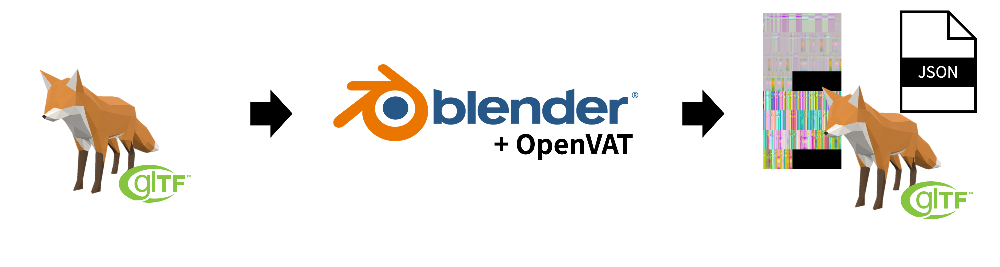

# Bevy OpenVAT

[](https://crates.io/crates/bevy_open_vat)
[](./LICENSE-MIT)
[](https://bevyengine.org/)

**Bevy OpenVAT** is a high-performance Vertex Animation Texture (VAT) plugin for the Bevy game engine. It enables rendering massive amounts of animated meshes with minimal CPU overhead by offloading animation processing to the vertex shader.

## Features

- **GPU-Powered Animation:** Decodes position and normal offsets directly in the vertex shader for maximum efficiency.
- **High Performance Instancing:** Uses `StorageBuffers` to render thousands of animated entities with few draw calls.
- **Smooth Interpolation:** Supports frame blending for fluid animation playback.
- **PBR Compatible:** Built on top of Bevy's `StandardMaterial`, fully supporting lighting, shadows, and depth pre-pass.
- **Flexible Control:** Per-entity control over playback speed, looping, and time offsets.

## Installation

| Bevy Version | Crate Version |
| :--- | :--- |
| `0.19` | `0.19` |
| `0.18` | `0.18` |

Add the following to your `Cargo.toml`:

```toml
[dependencies]
bevy = "0.19"
bevy_open_vat = "0.19.0"
```

## Usage

1. Add the `OpenVatPlugin` to your Bevy app.
2. Load your JSON (`RemapInfo`), VAT texture (`Image`), and standard glTF models.
3. Add the `VatAnimator` component to the entity with the mesh and `StandardMaterial`. The plugin will automatically convert the material to a VAT-enabled material.

```rust
use bevy::prelude::*;
use bevy_open_vat::prelude::*;

fn main() {
    App::new()
        .add_plugins((DefaultPlugins, OpenVatPlugin))
        // ... setup systems ...
        .run();
}

fn setup(
    mut commands: Commands,
    asset_server: Res<AssetServer>,
) {
    // Load assets
    let remap_info: Handle<RemapInfo> = asset_server.load("model_remap.json");
    let vat_texture: Handle<Image> = asset_server.load("model_vat.exr");
    let clip: Handle<VatAnimationClip> = asset_server.load("model_remap.json#AnimationName");

    // Spawn entity with VAT animator
    commands.spawn((
        Mesh3d(asset_server.load("model.gltf#Mesh0/Primitive0")),
        MeshMaterial3d(asset_server.load("model.gltf#Material0")),
        Transform::default(),
        // Add VatAnimator to automatically convert the material
        VatAnimator {
            remap_info,
            vat_texture,
            current_clip: clip,
            is_playing: true,
            speed: 1.0,
            ..default()
        },
    ));
}
```

## Asset Preparation

To use this plugin, you need exported VAT assets. Typically, this includes:

1.  **Geometry (.glb or .gltf):** A static mesh with UV2 coordinates mapped for VAT lookup.
2.  **VAT Texture (.exr):** High-precision texture encoding vertex position (and optionally normal) offsets.
3.  **Remap Info (.json):** Metadata containing animation frame counts, bounding box info, and clip names.

> **Note:** Ensure your VAT textures are exported with settings compatible with your shader (e.g., coordinate system handling).

### Preparation
1. Install the **OpenVAT** plugin for Blender.

### Conversion Workflow


1.  **Load Model:** Open Blender and load the model file containing your animations.
2.  **NLA Setup:** In the NLA (Non-Linear Animation) editor, combine the animations you want to extract into a single continuous sequence.
3.  **Open Panel:** Open the OpenVAT panel (Press `N`).
4.  **Configure:** Select the target model and configuration options.
    > **Important:** You must manually set the **frame range** at the bottom of the panel to match your NLA sequence.
5.  **Export:** 1.  Generate/Export the VAT texture using the plugin.
    2.  Select the **preview model** generated by OpenVAT in the viewport.
    3.  Export this preview model to **glTF** format.

### Export Notes

* **Materials:** Models extracted directly by the OpenVAT tool often have stripped material data. We recommend exporting the generated **preview model** as glTF to maintain material slots.
* **glTF Settings:** When exporting the glTF, ensure the following data is **EXCLUDED** (unchecked):
    * Animation Data
    * Skinning Data

## License

This project is licensed under either of

 * Apache License, Version 2.0, ([LICENSE-APACHE](LICENSE-APACHE) or http://www.apache.org/licenses/LICENSE-2.0)
 * MIT license ([LICENSE-MIT](LICENSE-MIT) or http://opensource.org/licenses/MIT)

at your option.